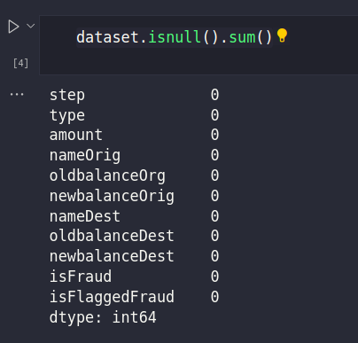
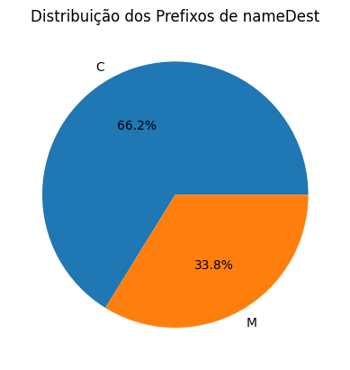
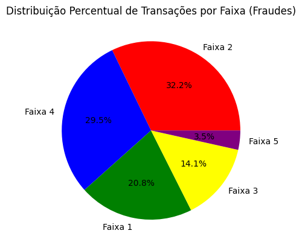
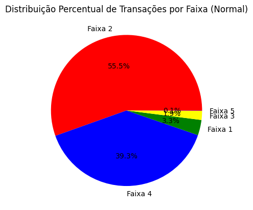
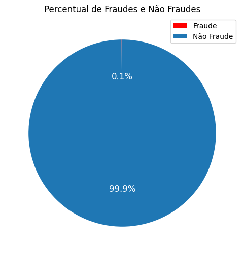
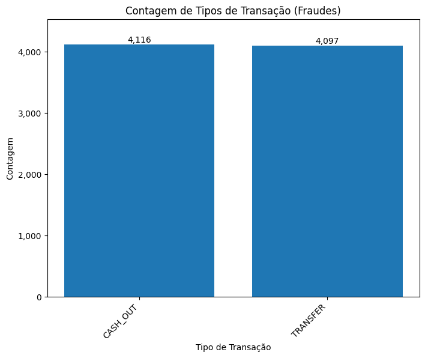
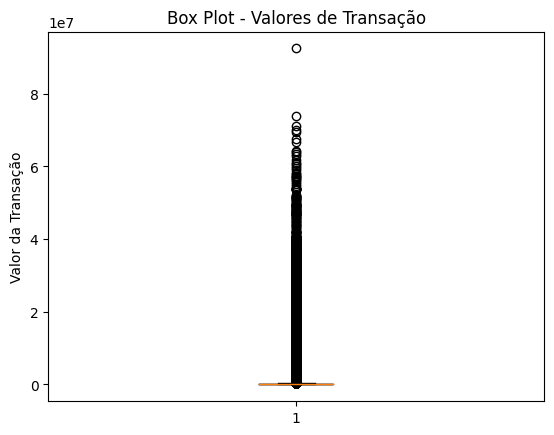
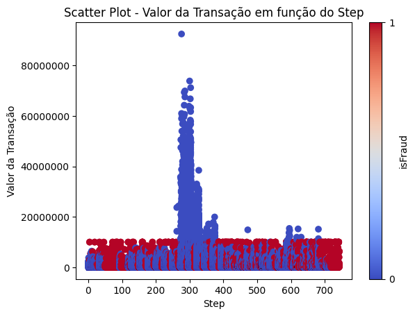
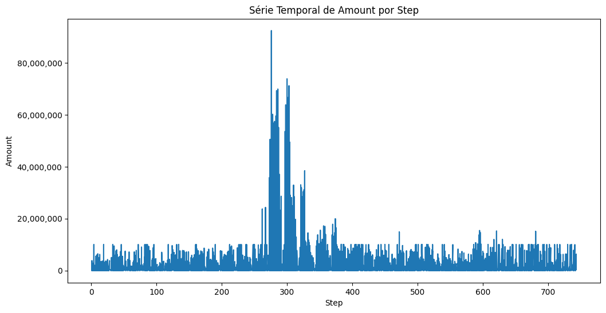
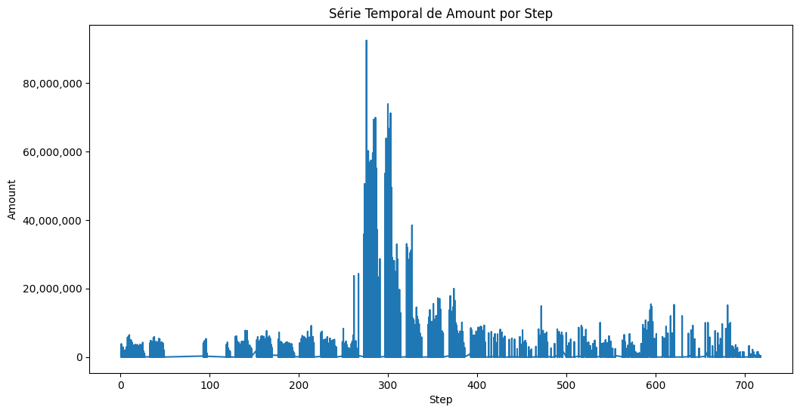

<h1>Atividade A3 de Análise de Dados e Big Data e Inteligência Artificial</h1> 

<h3>Introdução</h3> 

Este read-me é o relatório final da UC de Anaĺise de Dados e Big Data dentro do Ecossistema Ânima educação, esta UC não é ministrada somente nos cursos de Tecnologia, existem alunos de Marketing, Administração, Estatística entre outros.
O trabalho consiste em escolher um dataset e conduzir uma análise exploratória de dados, que traga exploração dos dados e visualização dos mesmos.

Neste projeto temos dois Alunos de Cursos de Tecnologia:

Jorge Leandro Piva Ciência da Computação RA: 820268722

Valério Vanuzi Pereira Bancos de Dados RA: 32213195 

Estamos cursando também a UC de Inteligência Artificial, apesar de não ter sido um requisito, utilizamos o mesmo dataset da análise exploratória desta UC para rodar os algoritmos de machine learning solicitados na UC de Inteligência Artificial esta que tem um relatório apartado em PDF neste repositório.

Então para trazer um dataset que fosse útil para as duas UCs procuramos um dataset que tivesse dados rotulados, nossos algoritmos de IA são de aprendizado supervisionado, ou seja, precisamos dividir os dados em dados de treino e teste e fazer o treinamento dos mesmos já com os valores rotulados, posteriormente utilizaremos os dados de teste para tentar prever a variável alvo, mas antes de fazer os algoritmos de machine learning iremos explorar a base de dados, tentar entender tendências e extrair informações úteis sobre os dados.

Como estamos na UC de Análise de Dados e Big Data um outro requisito que levamos em consideração foi referente ao tamanho do dataset, optamos por um dataset longo que tivesse mais de 1048576 ou seja, é um dataset que não poderia ser aberto com Microsoft Excel, desta forma, mostramos a complexidade de trabalhar com grande volume de dados e também a necessidade do profissional moderno de aprender novas ferramentas, se estamos na era dos dados, se os dados são o novo petróleo como se limitar a 1 milhão de linhas? 
Ao mesmo tempo que mostramos a complexidade de ter que trabalhar com grandes volumes de dados também mostramos como não é tão complexo fazer isso com frameworks que já estão prontos para análise de dados como por exemplo o pandas que facilita o trabalho e transforma o dataset em uma verdadeira planilha de Excel com uma linguagem de programação poderosa.

Sempre que falamos em programação, pessoas que não são da área acabam se assustando e achando que é muito complexo, mas acreditamos que com um pouco de dedicação e estudo é possível aprender ferramentas e técnicas avançadas que te torna um profissional diferenciado mesmo para quem não é da área de tecnologia mas precisa tomar decisões baseadas em dados.

Uma observação importantes para ser feita, como este dataset possuí 493,5 MB (493.534.783 bytes) não é possível subir ele no github junto com o notebook de análise exploratória, utilizamos uma técnica do próprio github para não mandar arquivos de senhas ou arquivos pesados de dependências do node por exemplo que é o arquivo .gitignore, ou seja, criamos uma pasta chamada dataset na pasta que está o jupyter notebook e colocamos ela como uma exclusão, para reproduzir o resultado do notebook é necessário baixar o dataset ou no Kaggle ou em um link em nosso repositório no google drive que deixamos disponível caso por algum motivo o Kaggle remova o dataset. 

Abaixo os links:

Kaggle:

<a href='https://www.kaggle.com/datasets/chitwanmanchanda/fraudulent-transactions-data'>https://www.kaggle.com/datasets/chitwanmanchanda/fraudulent-transactions-data</a> 

Google Drive:

<a href='https://drive.google.com/file/d/1Uwtd9_sW51Au0M1RtDBCGHL7Q9Ar14Gu '>https://drive.google.com/file/d/1Uwtd9_sW51Au0M1RtDBCGHL7Q9Ar14Gu</a>

Basta criar uma pasta dataset na mesma pasta que está o jupyter notebook e salvar com o nome Fraude.csv.

<h3>Ferramentas</h3>

Para este projeto utilizamos a Liguagem de programação python na versão 3.9.13 a distribuição escolhida foi o pacote para Ciência de Dados

Anaconda em sua versão 23.1.0.

Utilizamos as seguites Libbs do python.

pandas - para manipulação do dataframe.

matplotlib.pyplot - lib para plotar a maioria dos gráficos que serão apresentados

matplotlib.ticker - Para personalizar melhor os eixos dos gráficos

warnings  - para remover alguns warnings

seaborn - para plotar o heatmap 

numpy - Para calcular os quartil. 

datetime - para medir os tempos de execução.

Todas as ferramentas abaixo da biblioteca sklearn 

train_test_split - para dividir o dataset em teste e treino

LabelEncoder  - Para deixar todas as variáveis em numéricas

StandardScaler - Para padronizar as variáveis numéricas

DecisionTreeClassifier -Algoritmo da Árvore de Decisão 

LogisticRegression - Algoritmo de Regressão Logística

MLPClassifier - Rede Neural MLP

SVC - Algoritmo de Classificação por Vetores 

naive_bayes - Algoritmo de Classificação Naive Bayes

KNeighborsClassifier - Algoritmo de Vizinhos próximos KNN

accuracy_score - Para medir a acurácia dos algoritmos.

<h3>Objetivos </h3>

Conduzir uma análise exploratória e entender a hitória que estes dados nos contam e no final criar um algoritmo com uma acuracidade razoável para prever fraudes, iremos testar diversos algoritmos e entender qual que é mais efetivo para este contexto.

Também iremos explorar os dados, verificar se existem outliers e buscar algum padrão nas transações sejam as normais ou as fraudulentas.

<h3>Metodologia</h3> 

Análise Exploratória de Dados: Iniciamos com uma análise exploratória dos dados, que envolveu entender a estrutura e os tipos de variáveis presentes no conjunto de dados. Exploramos estatísticas descritivas, visualizações e gráficos para compreender a distribuição e as relações entre as variáveis.

Pré-processamento de Dados: Realizamos o pré-processamento dos dados, que incluiu etapas como limpeza, tratamento de dados faltantes, remoção de outliers e transformação de variáveis. Também realizamos codificação de variáveis categóricas e normalização ou padronização dos dados quando necessário.

Visualização de Dados: Utilizamos gráficos e visualizações para representar os dados de forma mais compreensível. Criamos scatter plots, gráficos de barras e outros tipos de visualizações para identificar padrões, tendências e relações entre as variáveis.

Modelagem de Machine Learning: Aplicamos diferentes algoritmos de machine learning para construir modelos preditivos. Começamos com a árvore de decisão, utilizando o algoritmo DecisionTreeClassifier para realizar a classificação. Também utilizamos outros algoritmos, como Regressão Logística, MLP (Multi-Layer Perceptron) e Naive Bayes e algoritmo KNN (K-Nearest Neighbors) para realizar classificação baseada na proximidade dos vizinhos mais próximos

Avaliação de Modelos: Avaliamos o desempenho dos modelos utilizando métricas de avaliação adequadas para problemas de classificação, como a acurácia. Calculamos a acurácia geral, bem como a acurácia específica para as classes "fraude" e "não fraude". Isso nos permitiu entender como os modelos performaram em diferentes cenários.

Comparação de Modelos: Comparamos os resultados dos diferentes modelos e analisamos suas performances. Com base nas métricas de avaliação e nas necessidades específicas do problema, podemos identificar o modelo mais adequado para a tarefa de prever transações fraudulentas.

<h3>Análise e Consolidação</h3> 

O dataset possuí as seguintes variáveis:

<b>step</b> - mapeia uma unidade de tempo no mundo real. Neste caso, 1 passo é 1 hora de tempo. Total de etapas 744 (simulação de 30 dias).

<b>type</b>- CASH-IN, CASH-OUT, DEBIT, PAYMENT e TRANSFER.

<b>amount</b>- valor da transação em moeda local.

<b>nameOrig</b> - cliente que iniciou a transação

<b>oldbalanceOrg</b> - saldo inicial antes da transação

<b>newbalanceOrig</b> - novo saldo após a transação

<b>nameDest</b> - cliente que é o destinatário da transação

<b>oldbalanceDest</b> - destinatário do saldo inicial antes da transação. Observe que não há informações para clientes que começam com M (Comerciantes).

<b>newbalanceDest</b> - novo destinatário do saldo após a transação. Observe que não há informações para clientes que começam com M (Comerciantes).

<b>isFraud</b> - São as transações feitas pelos agentes fraudulentos dentro da simulação. Neste conjunto de dados específico, o comportamento fraudulento dos agentes visa lucrar tomando controle ou contas de clientes e tentando esvaziar os fundos transferindo para outra conta e depois sacando do sistema.

<b>isFlaggedFraud</b> - O modelo de negócios visa controlar transferências massivas de uma conta para outra e sinaliza tentativas ilegais. É uma flag criada pelo próprio modelo.
 

Primeiramente verificamos que não haviam valores nulos

Porém, percebemos que só haviam 3 variáveis de texto e só uma era categórica, que é a type, o restante eram os códigos dos clientes de origem e destino, então criamos algumas variáveis categóricas, uma faixa com o valor da transação, um prefixo para o nameOrig e um prefixo para o nameDest
 

Descobrimos que existiam 2 prefixos o C e o M para o nameDest e o M era praticamente um terço das transações, porém, não havia nenhuma fraude nos clientes de prefixo M
 
 

Porém, não haviam fraudes de clientes com prefixo M

As faixas de valores foram criadas da seguinte forma:

a primeira faixa vai de 0 a 100.000

a segunda faixa vai de 100.000 a 500.000

a terceira faixa vai de 500.000 a 1.000.000

a quarta faixa vai de 1.000.000 a 10.000.000

a quinta faixa são valores maiores que 10.000.000

Percebemos que os valores de fraudes estavam distribuídos em todas as faixas de valores que criamos

 

Porém, essa ditribuição mais organizada não ocorria nas transações não fraudulentas.

 

Também descobrimos que o percentual de transações fraudulentas era muito pequeno
 
 

E só ocorreram em dois tipos de transações
 
 

Então foram identificados os outliers através de um box-plot e pareciam ser muitos

 

Para se ter uma idéia esse deveria ser o formato de um boxplot normal

 

Então plotamos um scatter plot para entender melhor esses outliers, lembrando que a variável step representa uma série temporal

Este gráfico é o centro da análise, nele é possível perceber diversas situações

Primeramente temos uma grande sazonalidade e apenas um outlier, mas os valores dessa sazonalidade são muito superiores ao 3 quartil, outra coisa impactante é que nenhum desses valores maiores são fraudulentos, os valores fraudulentos se mantém distribuídos em diversas faixas de valores e sempre iguais ou inferiores a 10.000.000

 

A Série temporal em si dos valores gerais é bem irregular conseguimos ver a distribuição de todas as transações.
 

Mas parece que este gráfico foi pintado com uma caneta e uma régua na faixa dos 10.000.000 em alguns casos, existe uma regularidade, se plotarmos o gráfico sem as fraudes vemos que não há essa régua como com o dataset geral.
 
Apresentação dos Resultados

Discussão dos Padrões e Tendências

Análise de Segmentos ou Subgrupos 

Interpretação dos Resultados 

Limitações e Vieses

Conclusão 

